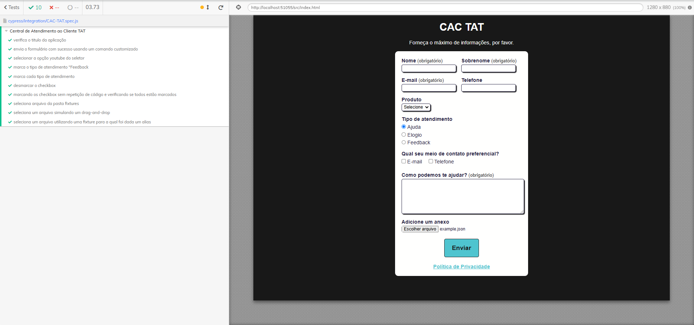

## Seção 3 

Abordado nessa seção os principais comandos para um teste básico em uma aplicação de atendimento/formulário online, onde foi realizado testes explorando as funcionalidades dos comandos:
- cy.vistit
- should
- type
- click
- get
- beforeEach
- select
- clear
- contains
- select
- check
- each
- wrap
- uncheck
- last
- expect 
- selectFile

Também foi realizado a leitura de artigos para complemento do aprendizado em aula e aplicados nos testes.
Aritgos estudados para complementação do aprendizado:
-  [Aprenda como remover duplicações na chamada do comando .check( )](https://talkingabouttesting.com/2021/06/14/como-marcar-varios-checkboxes-de-uma-so-vez-com-cypress/)
- [Como proteger credenciais de acesso, tais como usuário e senha no Cypress](https://talkingabouttesting.com/2021/02/09/como-proteger-dados-sensiveis-com-cypress/)

- [ Testes reutilizáveis e personalizados](https://talkingabouttesting.com/2021/02/10/como-criar-comandos-customizados-com-cypress/)

- [Como criar comandos customizados com Cypress](https://talkingabouttesting.com/2021/02/10/como-criar-comandos-customizados-com-cypress/)

